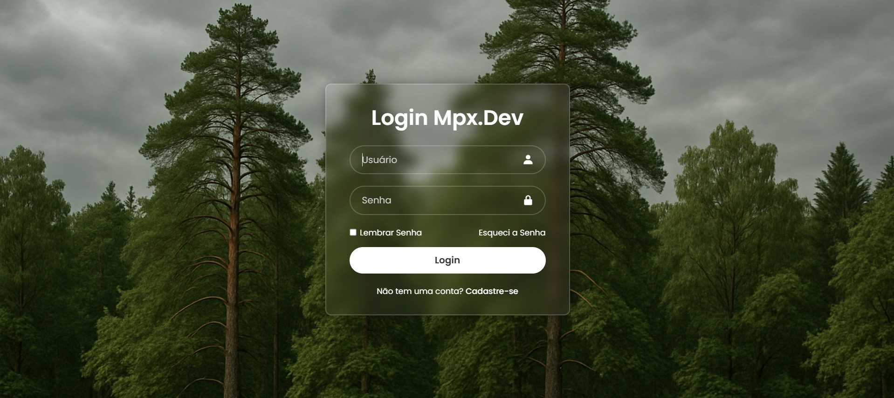

# Tela de Login MPX

Tela de login moderna e responsiva com efeito *glassmorphism*, desenvolvida com HTML e CSS puro. Ideal para projetos de front‑end, estudo ou integração com back‑end.

  

---

## 🔧 Tecnologias

- HTML5  
- CSS3  
- Google Fonts (Poppins)  
- Boxicons  

---

## ✨ Funcionalidades

- Layout responsivo  
- Estilo moderno com fundo desfocado (*glassmorphism*)  
- Ícones nos campos de entrada  
- Botão com efeito hover  
- Links para "Lembrar senha" e "Cadastrar"  

---

## 📁 Estrutura de Pastas
📁 projeto‑login/
├── index.html
├── style.css
└── img/
├── preview.png
└── floresta.png

